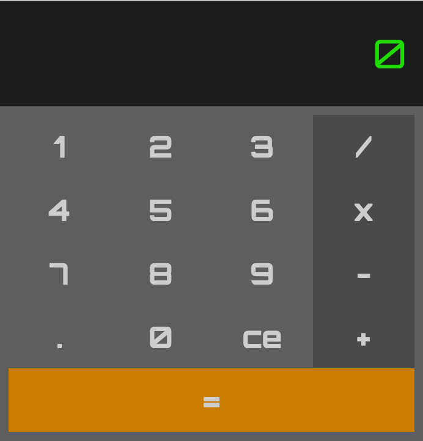

# Calculator React

A simple Calculator app created in React using TDD(test driven development) with Jest and Enzyme.

<div align="center">
  
</div>

## User Stories

```
As a user,
So I can see the numbers I'm adding
I would like to see them displayed above the calculator,

As a user,
So I can get the sum of two numbers,
I would like to be able to add two numbers.

As a user,
So I can get the reduce a number,
I would like to be able to subtract two numbers.

As a user,
So I can get the multiple of two numbers,
I would like to be able to multiply two numbers.

As a user,
So I can get the split a number equally,
I would like to be able to divide two numbers.

As a user,
So I can reuse a number,
I would like to sum to be stored.

As a user,
So I can correct my mistakes,
I would like to delete a number of the displayed number.

```

## Tech Used

- JavaScript
- React
- Jest
- Enzyme

## Features

You can:
  - Add
  - Subtract
  - Multiply
  - Divide
  - Add numbers to the display
  - Remove numbers from display

# Getting Started

## Local Setup

```sh
$ git clone https://github.com/kealanheena/calculator_react.git
```

```sh
$ cd react-calculator
```

```sh
$ npm install
```

## Run Locally

```sh
$ npm start
```

## Run Tests

```sh
$ npm test
```

### Test Coverage

#### Unit Tests
- Key:
  - should render correctly(snapshot)
  - should render a <div/>
  - should render the value of the keyValue
- Keypad:
  - should render correctly(snapshot)
  - should render a 4 <div/>'s
  - should render an instance of the key component for each index of numbers, operators, and the submit Key
  - renders the values of numbers
  - renders the values of operators
- Display:
  - should render correctly(snapshot)
  - should render a <div/>
  - renders the value of displayValue
- Calculator:
  - should render correctly(snapshot)
  - should render a <div/>
  - should render Display and Keypad Components
    - updateDisplay
      - updates displayValue
      - concatenates displayValue
      - removes leading "0" from displayValue
      - prevents multiple leading "0"s from displayValue
      - removes last char of displayValue
      - prevents multiple instances of "." in displayValue
      - will set displayValue to "0" if displayValue is equal to an empty string
    - setOperator
      - updates the value of the selectedOperator
      - update the value of storedValue to the value of displayValue
      - updates the value of displayValue to "0"
      - selsctedOperator is not an empty string, does not update storedValue
    - callOperator
      - updates displayValue to the sum of storedValue and displayValue
      - updates displayValue to the difference of storedValue and displayValue
      - updates displayValue to the product of storedValue and displayValue
      - updates displayValue to the quotient of storedValue and displayValue
      - updates displayValue to "0" if operation results in "NaN"
      - updates displayValue to "0" if operation results in "Infinity"
      - updates displayValue to "0" if selectedOperator does not match cases
      - updates displayValue to "0" if called with no value for storedValue or selectedOperator
- App:
  - should render correctly(screenshot)
  - should render a <div />
  - should render the Calculator Component

#### Feature Tests
- Calculator:
  - calls updateDisplay when a number is clicked
  - calls setOperator when an operator key is clicked
  - calls callOperator when the submit key is clicked
