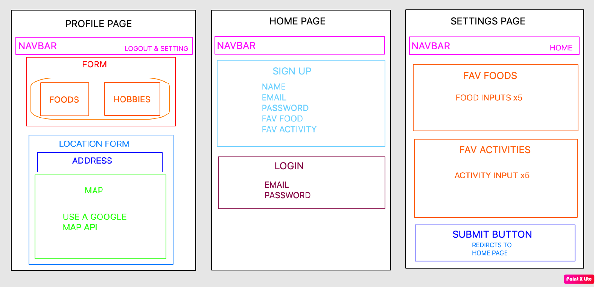

# It's A Date

This is an app that will take your favorite cusines and another persons favorite cusines and plan a date based on what you both have in common. d

## Layout



## User Stories

```
As a user, 
So I can keep track of all my dates, 
I would like to be able to sign in and sign out.

As a user, 
So I can find a fun date,
I would like to be able to log my hobbies.

As a user,
So I can have my fav food on a date,
I would like to be able to log my fav cuisines.

As a user ,
So I can plan multiple dates ,
I would like to create a date plans.

As a user ,
So I can be cost effective,
I would like to be able to set a price range.

As a user,
So I don’t have to travel too far,
I would like to set a radius from my locations .

As a user, 
So organise my date,
I would like to set a time for my date.

As a user ,
So I don t have to travel too far,
I would like to set a radius from the restaurant to the hobby.

```

## Tech Used

- JavaScript
- React
- Jest
- Enzyme

## Features

# Getting Started

## Local Setup

```sh
$ git clone https://github.com/kealanheena/its_a_date.git
```

```sh
$ cd its_a_date
```

```sh
$ npm install
```

## Run Locally

```sh
$ npm start
```

## Run Tests

```sh
$ npm test
```

### Test Coverage

#### Render Tests

- Form:
  - should render a div
  - should render 2 select tags
  - should render 6 option tags
  - should render submit button
  - should call setCuisines function when clicked on submit button

- App:
  - Shallow App:
    - should render a div
    - should render the Form Component
  - Mounted App:
    - should have default state as Chinese for person one and two
    - should change the state when options is change
    - should change the state when options is change

#### Unit Tests

#### Feature Tests

